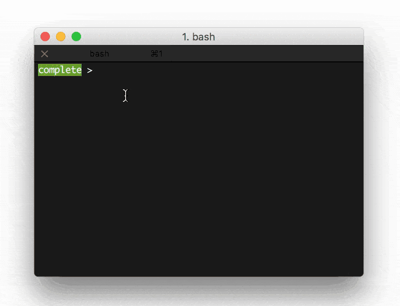

# Google, you autocomplete me

This script will take up to three or four words, perform a google search and return a list of suggested autocomplete phrases.It uses the [Python Prompt Toolkit](https://github.com/jonathanslenders/python-prompt-toolkit) and Google's autocomplete API.

Install:

`pip install -r requirements.txt`

`python completme.py`
